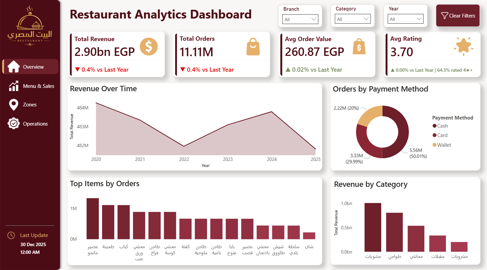
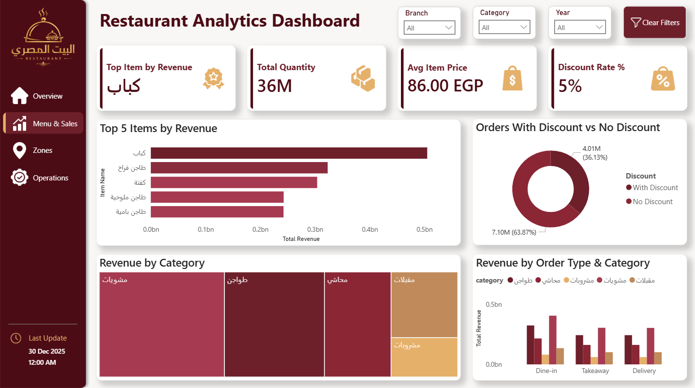
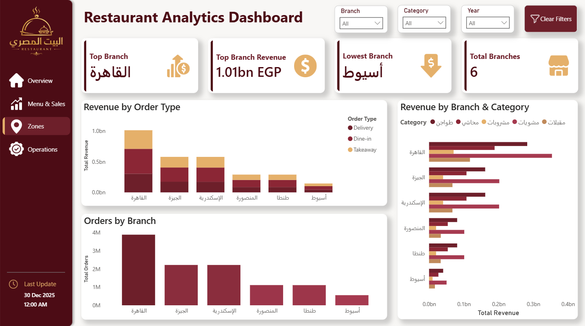
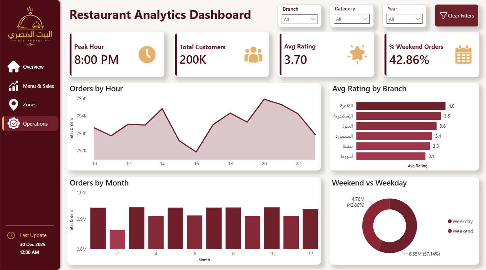

# 🍽️ Al Beit Al Masry — Restaurant Analytics Dashboard

> A full-scale business intelligence project analyzing **11.1 million orders**
> across 6 branches using **Databricks** and **Power BI**.

---

## 📊 Dashboard Preview

### Overview


### Menu & Sales


### Zones & Branches


### Operations & Quality


---

## 🗂️ Project Structure

```
restaurant-analytics/
├── assets/          # Dashboard screenshots
├── notebook/        # Databricks analysis notebook
├── powerbi/         # Power BI report file (.pbix)
└── README.md
```

---

## 🛠️ Tech Stack

| Tool | Purpose |
|------|---------|
|  | Data processing & analysis on Delta Lake |
|  | Dashboard & visualization via DirectQuery |
|  | Querying & aggregations |

---

## 📁 Dataset

| Property | Value |
|----------|-------|
| 📦 Size | ~1.5 GB |
| 🔢 Rows | 11,110,000 |
| 📅 Period | 2020 – 2025 |
| 🏙️ Branches | Cairo, Giza, Alexandria, Mansoura, Tanta, Assiut |
| 🍖 Categories | Grills, Tagines, Stuffed Dishes, Appetizers, Beverages |

> 🔗 [Download Dataset from Google Drive](https://drive.google.com/drive/u/0/mobile/folders/1KcGAxBpvXuYHrVnfz6KaxJszFzalE5pP?usp=sharing)

---

## 📈 Key Insights

| Metric | Value |
|--------|-------|
| 💰 Total Revenue | 2.90bn EGP |
| 📦 Total Orders | 11.11M |
| 🏙️ Top Branch | Cairo — 34.6% of total revenue |
| 🥇 Top Item | كباب — highest revenue item |
| ⏰ Peak Hour | 8:00 PM |
| 💳 Top Payment | Cash — 50% of orders |
| ⭐ Avg Rating | 3.70 / 5.00 |
| 🥩 Top Category | Grills — 35.9% of total revenue |

---

## 📋 Dashboard Pages

### 1️⃣ Overview
High-level summary of business performance including total revenue, orders, average order value, and rating trends over time.

### 2️⃣ Menu & Sales
Deep dive into item and category performance. Identifies top-selling items by revenue and quantity, discount analysis, and revenue distribution across order types.

### 3️⃣ Zones & Branches
Branch-level comparison across 6 cities. Highlights top and lowest performing branches, revenue share, and order type distribution per branch.

### 4️⃣ Operations & Quality
Operational insights including peak hours, weekend vs weekday behavior, monthly order trends, and customer satisfaction ratings by branch.

---

## 🔌 Power BI Connection Setup

This report uses **DirectQuery** on Databricks Delta Lake.

**To connect:**
1. Open `Restaurant_Analysis_Dashboard.pbix` in Power BI Desktop
2. Go to **Home → Transform Data → Data Source Settings**
3. Select the Databricks source → **Edit Permissions**
4. Enter your **Server Hostname** and **HTTP Path** from Databricks
5. Authenticate using your **Personal Access Token (PAT)**

> ⚡ DirectQuery is used to handle the 11M+ row dataset without importing data into Power BI.

---

## 👤 Author

**Abdelrahman Refaat**

[](https://www.linkedin.com/in/abdelrahman-elgam/)
